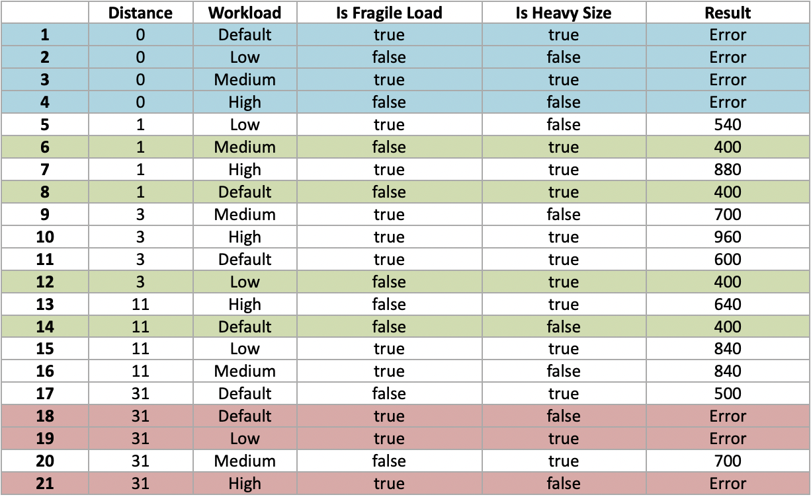

## Yandex Praktikum test task  
  
### Как запустить  

    git clone  
    cd yandex-praktium-test-task  
    ./gradlew clean test  

  
### Вопрос  
Как бы вы тестировали/проверяли корректность, полноту и неизбыточность ваших тестов? Как бы вы осуществляли эти проверки в автоматическом режиме? Ответ приложите в текстовом виде в любом удобном формате.  
  
### Ответ  
Функция написана на типизированном языке программирования и на вход принимает 4 параметра. Два из них это boolean, один Enum и еще один double. В связи с этим проверки на валидность вводимых данных нам нужны только по параметру distance(double). А так как по условиям distance может принимать любые значения больше 0, то нам достаточно проверять лишь одно это условие.  
Также нужно учитывать что нет необходимости тестировать все возможные distance в интервале (0,∞). Достаточно выбрать по одному любому значению distance из интервалов приведенных в задании, я взял: 0,1,3,11,31.  
Для оценки полноты/не избыточности тестов я применил технику pairwise. Для этого с помощью специального генератора создал таблицу необходимых тестов:  
  
  
Чтобы еще сократить кол-во тестов я выделил 3 группы, каждую из которых можно объединить в один тест:  
1) Дистанция меньше(или равна) нулю (синий цвет)  
2) Значение минимальной цены перетирает значение рассчитанное основным алгоритмом (зеленый цвет)  
3) Невозможность доставить хрупкий груз на дистанцию более 30 километров (красный цвет)  
  
Чтобы не писать тесты руками я использовал возможность параметризованных тестов junit5 принимать в качестве параметра csv файл.  
Для проверки корректности тестов и получения ожидаемых результатов(столбец results) я воспользовался калькулятором :-)  
Что касается автоматизации проверки тестов, то можно считать что мое решение уже частично автоматизированно, но для полной автоматизации можно было бы воспользоваться генераторами pairwise уже написанными для junit, но в данном тестовом задании я посчитал, что csv таблица будет нагляднее. Также я провел дополнительное тестирование code coverage, которое показало 100% покрытие всех строк функции.